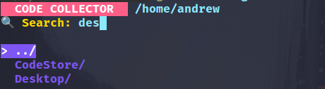
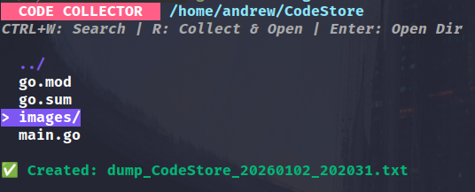

# CodeStore 🚀

A powerful code storage and management utility built with Go! 🎉

## Overview

CodeStore is a versatile tool designed to help you manage and store your code snippets efficiently. Whether you're a developer looking to organize your code or need a quick way to dump and retrieve code, CodeStore has got you covered!

## Features

- 📦 **Efficient Code Storage**: Store and manage your code snippets with ease
- ⚡ **Fast Retrieval**: Quickly access your stored code when you need it
- 🔍 **Search Functionality**: Find exactly what you're looking for
- 📁 **Organized Structure**: Clean and intuitive organization of your code
- 🛠 **Go-Powered**: Built with the speed and reliability of Go

## Screenshots

Check out CodeStore in action! 📸

### Search Function


### Working Results


## Installation

1. Make sure you have Go installed on your system
2. Clone this repository:
   ```bash
   git clone https://github.com/yourusername/CodeStore.git
   ```
3. Navigate to the project directory:
   ```bash
   cd CodeStore
   ```
4. Run the application:
   ```bash
   go run main.go
   ```

## Usage

### Direct Execution
Simply run the application directly:
```bash
go run main.go
```

### Install Globally
To make CodeStore available from anywhere on your system:

1. Build the binary:
   ```bash
   go build -o codestore main.go
   ```

2. Move the binary to a directory in your PATH:
   ```bash
   # Option 1: Move to /usr/local/bin (requires sudo)
   sudo mv codestore /usr/local/bin/

   # Option 2: Move to $HOME/bin (doesn't require sudo, but ensure $HOME/bin is in your PATH)
   mv codestore $HOME/bin/
   ```

3. Now you can run CodeStore from anywhere:
   ```bash
   codestore
   ```

### Build and Install with Go
Alternatively, you can install it directly using Go:
```bash
go install .
```
This will build and install the binary to your `$GOBIN` directory (or `$GOPATH/bin` if `$GOBIN` is not set), which should be in your PATH.

## Tech Stack

- **Language**: Go (Golang)
- **Architecture**: Command-line interface
- **Dependencies**: Managed via go.mod

## Contributing

We welcome contributions! 🤝

1. Fork the repository
2. Create a feature branch (`git checkout -b feature/amazing-feature`)
3. Commit your changes (`git commit -m 'Add some amazing feature'`)
4. Push to the branch (`git push origin feature/amazing-feature`)
5. Open a Pull Request

## License

This project is licensed under the MIT License - see the [LICENSE](LICENSE) file for details.

## Acknowledgments

- Built with ❤️ using Go
- Inspired by the need for better code organization
- Thanks to all contributors who make this project better!

---

⭐ **Star this repo if you find it useful!** ⭐